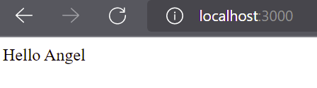

# MI PRIMER API

Para este proyecto se ocupará express como dependencia. Se creará un archivo llamadp **app.js** y dentro una app de express.

````
// Usando objeto express
const express = require('express')
// App de express
const app = express()
app.use(express.json()) //Indicamos que usaremos JSON
// Puerto en que vamos a ver nuestra app "localhost:3000"
const port = 3000


// Con esto inicializamos esta app
app.listen(port, () => {
    console.log(`Example app listening on port ${port}`)
})
````

## Crea un endpoint que regrese una lista de explorers (Método GET)

Empezamos poniendo una ruta principal, esto se hace definiendo un slash o un **"/"** y al momento que se escriba en el navegador localhost:3000 se visualizará como respuesta **"Hello Angel"**. De esta forma se pondrían definir otras rutas, y siempre se debe de usar el método GET.

```
app.get('/', (req, res ) =>{
    res.send('Hello Angel')
})
```



Se crea un endpoint con el método GET que regresará una lista de objetos. Esto nos permite mostrar en el navegador la lista de objetos y se agrega el código HTTP CODE 200 en el request. Por último, se levanta el servidor con el comando ***node app.js***

```
app.get('/v1/explorers', (req, res) => {
    console.log(`Api Explorers GET ALL request ${new Date()}`)
    const explorer1 = {id: 1, name: "Angel 1"}
    const explorer2 = {id: 1, name: "Angel 2"}
    const explorer3 = {id: 1, name: "Angel 3"}
    const explorer4 = {id: 1, name: "Alberto"}

    const explorers = [explorer1, explorer2, explorer3, explorer4]
    res.status(200).json(explorers)
})
```

Si ingresamos en el navegador a la ruta obtendremos la lista como se muestra a continuación:


## Probando el EndPoint

Para probar el endpoint se utilizará Postman y además, el archivo LaunchX.postman_collection.json. Se debe importar el archivo a Postman ya que contiene todos los request necesarios de esta práctica.

Para importar el archivo debemos de entrar a Postman, una vez dentro iremos a la parte de File>Import...
Después, seleccionaremos el archivo y damos clic en import. Y una vez cargado el archivo visualizaremos las peticiones.


Seleccionaremos el primer request que tiene el nombre de localhost:3000/v1/explorers y daremos clic al botón azul denominado "Send" y veremos la lista de objetos que anteriormente se había visto en el explorador cuando se escribía la ruta pero solo que ahora en Postman es a través de peticiones

### GET Crea un endpoint que te regrese un explorer mediante un ID

Se agrega el siguiente código:

```
// GET
app.get('/v1/explorers/:id', (req, res) => {
    console.log(`Api Explorers GET request ${new Date()}`)
    console.log(`Getting explorer with id ${req.params.id}`)

    const explorer = {id: 1, name: "Angel"}
    res.status(200).json(explorer)
})
```

Para que se vean los cambios se tiene que parar y volver a levantar el servidor y ahora se prueba el request 2 en Postman. Como es una petición GET también se puede observar esta petición en el navegador, solo tenemos que escribir la ruta.

Nota: Generalmente se utiliza una petición GET para mostrar algún dato.

### POST Crea un endpoint que se encargue de crear un explorer

Para la siguiente petición POST escribimos el siguiente código:

```
app.post('/v1/explorers', (req, res) => {
    console.log(`Api Explorers POST request ${new Date()}`)

    const requestBody = req.body // Parámetros de un cliente
    res.status(201).json({message: "Created"})
})
```

Esta petición se utiliza cuando queremos agregar datos, se envían parámetros para tal procedimiento, sin embargo, como no se envía ningún parámetro solo tenemos el mensaje de que ha sido creado. Y a diferencia de las demás peticiones, el status cambia por el 201.

Nota: Se utiliza una petición de tipo POST para insertar, crear un nuevo dato.

### PUT Crea un endpoint que se encargue de actualizar un explorer

Se agrega el siguiente código para la petición PUT:

```
// PUT
app.put('/v1/explorers/:id', (req, res) => {
    console.log(`Api Explorers PUT request ${new Date()}`)
    console.log(`Update explorer with id ${req.params.id}`)

    const requestBody = req.body //Parámetros de un cliente
    res.status(200).json({message: "Updated"})
})
```

Para actualizar un dato se utiliza el ID del usuario o de la tabla donde se requiera actualizar, una vez que se manda el ID se puede hacer una consulta para encontrar los datos que queremos actualiza.

Nota: Se utiliza una petición de tipo PUT para actualizar datos y mayormente se usa el ID.

### DELETE Crea un endpoint para eliminar un explorer

Para la petición delete usamos el siguiente código:

```
// DELETE
app.delete('/v1/explorers/:id', (req, res) => {
    console.log(`Api Explorers DELETE request ${new Date()}`)
    console.log(`Delete explorers with id ${req.params.id}`)

    const requestBody = req.body // Parámetros de un cliente
    res.status(200).json({message: "Deleted"})
})
```

Nota: Así mismo para borrar un dato mayormente se necesita el ID
